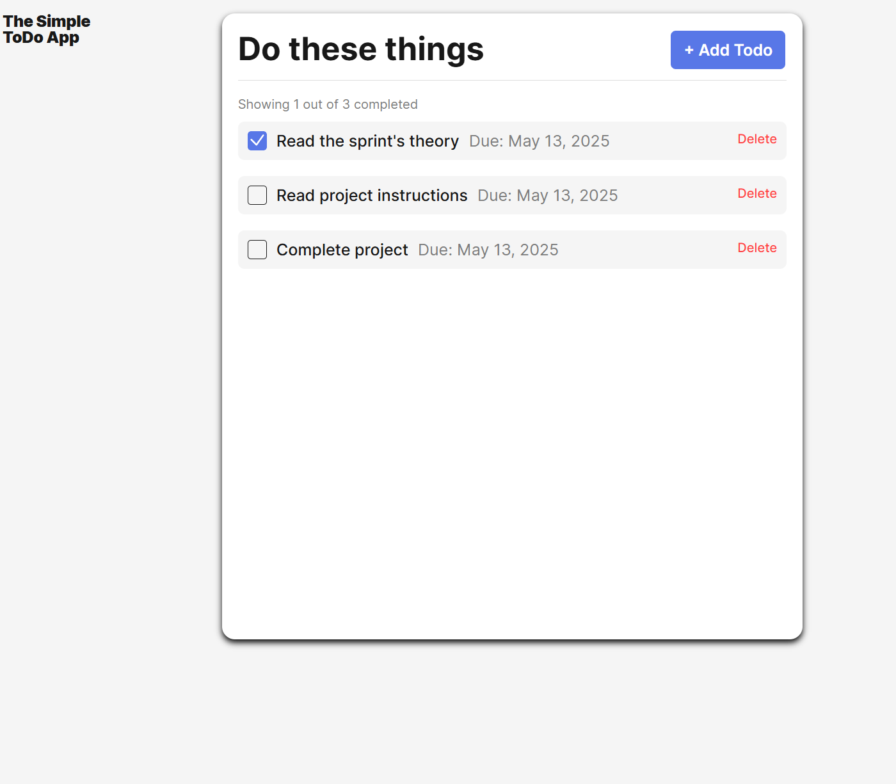

# Simple Todo App

A simple app to create a todo list with a due date. As well as check mark and delete completed todos.

## Functionality

This web aplication is designed to create a simple todo list. Get started with the add todo button to enter a new task. You will be able to create new todo item with an optional due date field. The input for the todos will require 2 min. characters. After adding new tasks you will be able to mark items with a check mark to keep track of todos as well as a delete button to remove todos.

## Technology & Image

Languages used: HTML, CSS, JavaScript

## Deployment

This project is deployed on GitHub Pages:(https://github.com/J-Magee0/se_project_todo-app.git)
